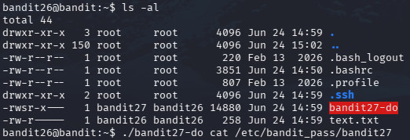

# INTRODUCTION
YOu are Greeted with Constant Kicks...Well thats normal..ITs set up to a different shell other than Bash..and It is configured to kick you out!!!
LETS BEGIN !!

# Essential Concepts
set shell command.....

# Part 1
just go on and minimize your screen and keep on loging in untill you see more and some % symbol
And no you are not done till yet!!
THe shell is set to a custom text script shell..

just enter v to enter the shell...and it says out that you can just enter: and followed by qa to exit..but we gonna exploit it...
just enter : and give it "set shell=/bin/bash"
still you are not done yet!!
now reboot the shell to bash
":shell" and hit enter...
Now is you list , you can see a badnit 27file..long list it to see the permission place, you can see the s (setuid)phrase for our group
so execute it..but give it instance to execute you command too....

voila...THANK ME LATER!!

                          -MADHAN.M
