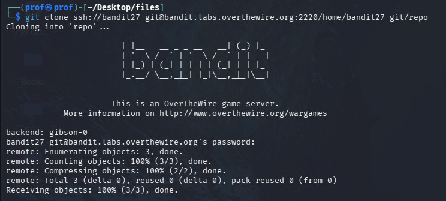

# INTRODUCTION
Welcome to level 27!!
Here we are gonna clone a git repo...but from a ssh server..
LETS BEGIN!!

# Essential Cncepts
ssh connection with the port specification..Just follow the guide!!
git clone

# PART 1
You know what, font connect to the bandit27 ssh server...
Its Clearly mentioned that we should clone at our local machine

use the git clone code followed by the link they gave

navigate into the repo directory you just created and cat README
you.ll get the flag

              -MADHAN.M
