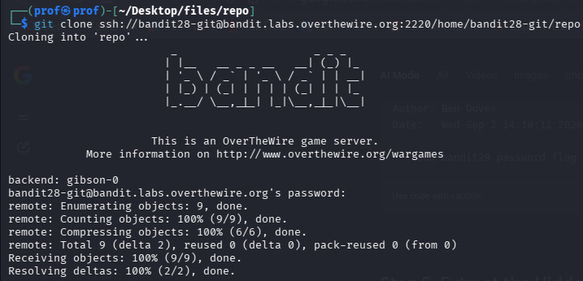
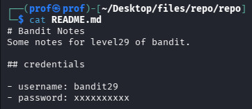
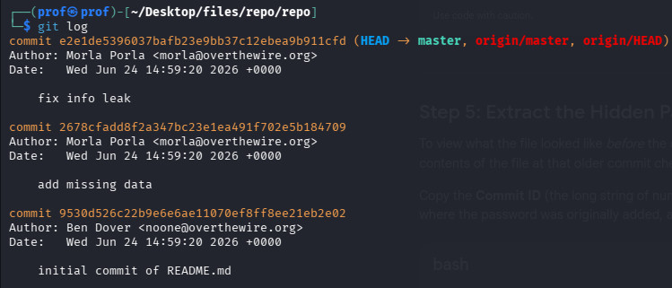
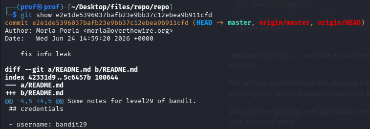

# INTRODUCTION
Welcome to Bandit28!!..
I guess you tried it..i know it hurted you,r feelings when you saw the password line with XXXXXXXXX
It means the Leaker has removed the commit from his file on github..
But don't worry!!...i Have the Meds!!!
Let's Get Started!!

# Essential Concepts
git log ; shows the history of commits (changes)
git show ; just to show the file..

# Part 1
Here too Don,t sign in the ssh...Just git clone the link OTW gave you!!

And you wanna see??

Use the git log..Just type it after the cloning process

you see!!! the history...and the Hard truth is, Yeah the deleted files and the past saves still exists!!
just 'git show' the commit id you saw on the output!!..Specifically the top most one!!

Voila..You got the Flag
                            -MADHAN.M
