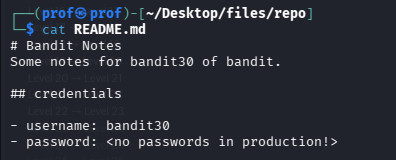
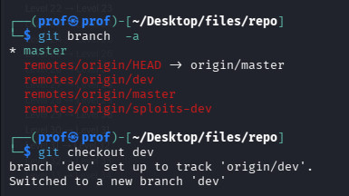

# INTRODUCTION
Welcome to Bandit29!!...

Here evrything is same..but you cant get the pass at the commit history as the original commit is hidden in another git branch

LETS BEGIN!!!

# Essential Concepts
git branch -a command : lists all the branches in the Repositery
git checkout command : to switch to that Folder!!

# PART !
clone the git repository and cat README file!!
you can,t get the password!!

And NO you cant get the pass via the level 28 way!!
Use the branch command!!followed by the checkout command!!

Now, cat the Readme !!
Thank Me Later!!
                            -MADHAN.M
