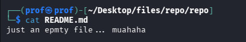
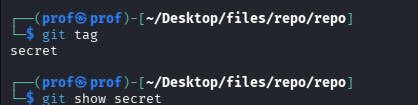

# INTRODUCTION
Welcome to Bandit30!!
Here TOO, the Flag is retarded!!and no there is no Branch too..

Lets Begin!!

# Essential Concepts
git tag : as time passes, even if a branch or log is moved, tag is persistant!!

# Part 1
Clone the Repository and just in case cat the README!!I Know you are roasted!!

And, Check the branches too!!

So , git always saves the files in "tags" even if many stuffs collapses!! it,s like a time vault!!
so pull the TAG!!!! And use show to get the pass!!

YOU GOT THE FLAG!!
                                -MADHAN.M
