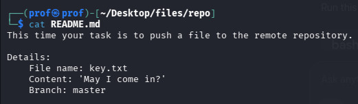
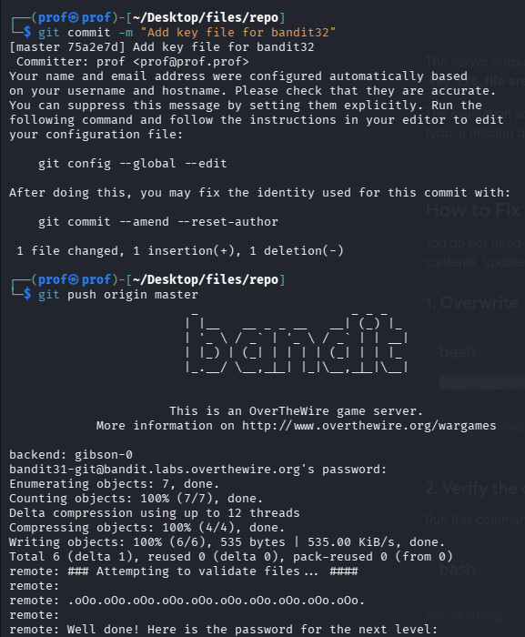

# INTRODUCTION
Welcome to Bandit31!!!
Here, There is no removal of Mistakes!!!
Its Just you need to send a file to get the pass beyond .gitignore restrictions!!

# Essential Concepts

git add : adds the Respective file you ask for!!
git commit -m : to commit the changes
git push : Typing origin tells Git: "Send this data back to the exact server I downloaded it from."
origin : Git automatically saved that long, ugly server address under the easy nickname origin.

# Part 1
Clone the Git Repository and cat the Readme file

we need to send a key file to git!!
but if you send, it returns errors as restriction is preloaded into .gitignore file
remove it and then create, add , commit and push to the origin!!

AND YEAH...FLAG FOUND YOU!!!!

                                           -MADHAN.M

