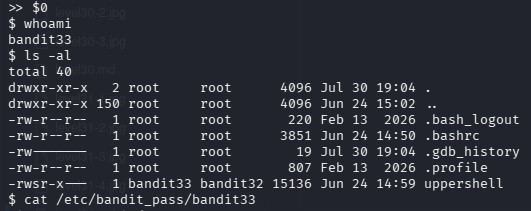

# INTRODUCTION
Welcome TO BANDIT32!!!!

YOU ARE GOING TO GRADUATE OverTheWire Bandit!!!

Here, its just a edited custom shell which changes everything you type to uppercase which LINUX wont Understand!!
LETS FINISH THE COURSE!!

# Essential Concepts
$0 : here its not a letter these are special Characters which the shell cant change it to Uppercase and it means to restart the shell which launched this custom shell!!

# Part 1
Just LOG in, Use the Concept of $0 i taught you!!!
YOU will get a normal prompt shell...get the Final flag from etc folder!!
And don,t Worry!! its a elevated SETUID shell...so you will get the bandit 33 pass by catting the etc folder!!
check with whoami if needed

  ### YOU ARE GRADUATED FROM OVER THE WIRE BANDIT ACADEMY OF LINUX TERMINAL
